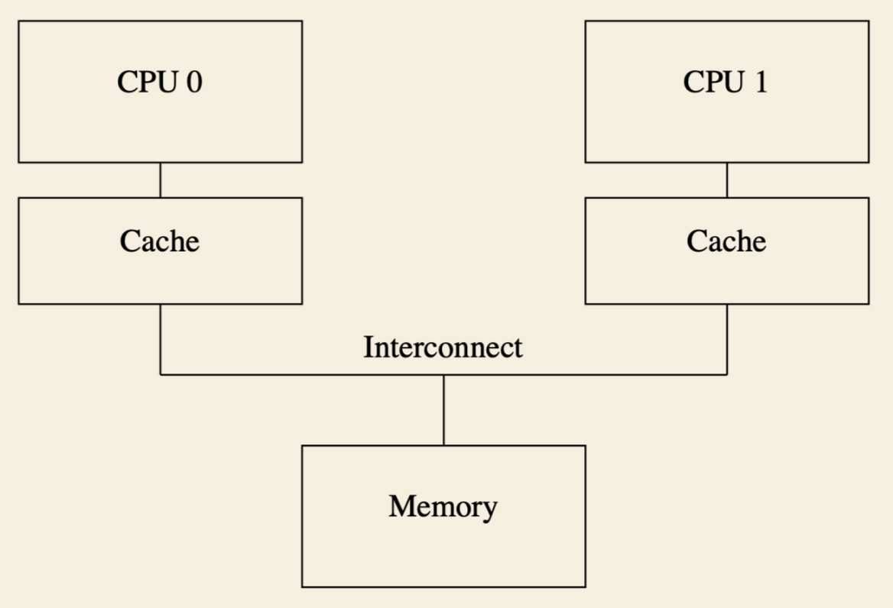
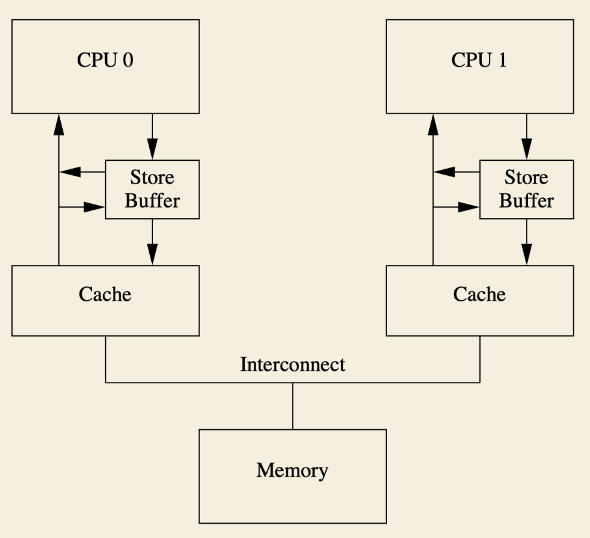
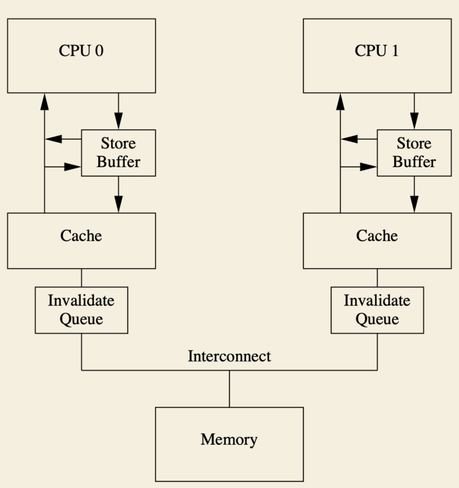

# Understanding Memory Barriers Step by Step - A Summary of "Memory Barriers: A Hardware View for Software Hackers"

## Introduction

This article is a summary of "Memory Barriers: A Hardware View for Software Hackers." and instead of covering all the details, I will focus on explaining how things come. Since memory barriers are quite complex, it is highly recommended to read the original paper for a more thorough understanding.

CPUs reorder memory references to improve performance. However, in certain situations—such as synchronization primitives—we need memory barriers to ensure correctness.

A highly simplified story is (The "→" represents causation):

*Multiple CPU cores + cache lines → data is replicated across different cache lines → Cache-Coherence Protocols are used to guarantee consistency → these protocols sometimes require blocking CPU execution → asynchronous messaging is introduced but causes state inconsistencies → memory barriers are used to guarantee partial ordering.*

Modern computers have multiple CPU cores, and each core has its own cache. This means a variable(address) might be replicated across different CPU caches. To prevent inconsistencies or data loss for a single variable across multiple caches, cache-coherence protocols are used.

Cache-coherence protocols rely on message exchanges between caches and main memory. These exchanges introduce latency, as CPUs must wait for acknowledgments, which is extremely slow compared to CPU processing speeds. For example, when a CPU performs a store operation, it might need to wait for acknowledgments from other CPUs, blocking its execution. To mitigate such stalls, CPUs proceed with local state updates without waiting for responses or quickly send acknowledgments without fully applying changes to the cache line. This behavior is similar to how changes within a database transaction remain visible only to that transaction until it is committed. Once the CPU receives all necessary responses, the updated state becomes globally visible to all CPUs.

While this approach works well for single variables, problems arise when multiple memory addresses and concurrent operations across CPUs are involved. **Memory barriers** address these issues by providing ordering guarantees. When a memory barrier is inserted, all memory operations (reads or/and writes) before it are guaranteed to complete before any memory operations after it begin. Using a database analogy, a memory barrier acts like a "commit," ensuring that all prior store and/or load operations are finalized before continuing. This enforces a *happens-before* relationship.

In the following sections, I will introduce the Cache-Coherence Protocols, store buffers and invalidate queues.

## Cache-Coherence Protocols



As data can be replicated to different CPU caches, cache-coherence protocols are required to ensure consistency.

Basically, a CPU can update a cache line only when that cache line has exclusive ownership of the cached data. For example, if a cache line is in a "shared" state (i.e., multiple caches have replicas of the same address), the CPU must send an "invalidate" message to all other CPUs and wait for their responses. Upon receiving this message, the other CPUs remove the corresponding data from their caches and respond. Once the CPU that initiated the invalidation receives all the responses, it gains exclusive ownership of the cache line and can modify it. This process is described in Transition (h) and Transition (b) of the paper.

While there are more details in the paper, the basic idea is the same: when a CPU wants to modify a cache line, it must have the exclusive ownership of the data.

## Store Buffers

### Why We Need Store Buffers

1. Cache-coherence protocols ensure consistency but can be slow.
   For example, a CPU must wait for responses from all other CPUs when writing to a shared cache line.
2. Store buffers are added to avoid blocking.
   The CPU can record its write operation in the buffer and continue executing other instructions.
3. The data is removed from the store buffer after the CPU receives all necessary acknowledgments.

Now the CPU becomes:



### Store Forwarding

As a CPU writes data to both the cache line and store buffer, for reading its own update, it needs to read from the store buffer (not directly from the cache).


For example, the following code is executed by a single CPU:

```c
1 a = 1
2 b = a + 1
```

At line 1(`a = 1`), the value 1 is stored in the store buffer. At line 2(`b= a + 1`), the CPU may need to read a. If it reads `a` from the cache directly, it would see the old value (0) because the new value hasn't been applied to the cache yet. To avoid this inconsistency, the CPU reads `a` from the store buffer, which has the updated value. This guarantee is called self-consistency, and the mechanism is referred to as store forwarding.


### Store Buffers and Memory Barriers

The next issue arises from the interaction of multiple variables and multiple CPUs.

```c
1. void foo(void) {
2.   a = 1;
3.   b = 1;
4. }
5.
6. void bar(void) {
7.  while (b == 0) continue;
8.  assert(a == 1);
9. }
```

Here, CPU 0 executes `foo`, and CPU 1 executes `bar`. If all instructions are executed in order, the assertion (`assert(a == 1)`) cannot fail. Surprisingly, hardware does not always guarantee this ordering.


Assume CPU 0 owns b in its cache but not a, and CPU 1 has a in its cache. When CPU 0 executes line 2 (`a = 1`), it stores the value in its store buffer because it doesn’t yet own `a`. When CPU 0 executes line 3 (`b = 1`), it updates b directly in its cache, as it already owns it. CPU 1 then executes line 7 (`while (b == 0)`), and upon detecting that `b` is 1, it proceeds to line 8 (`assert(a == 1)`). Since CPU 1 hasn’t received an "invalidate" message for `a`, it reads the old value (0) from its cache, causing the assertion to fail.

The failure occurs because after CPU 0 executes line 2 (`a = 1`), the value is still in its store buffer and not visible to other CPUs. However, line 3 (`b = 1`) is directly applied to the cache, making it visible. As a result, from CPU 1’s perspective, `b = 1` happens before `a = 1`, leading to an incorrect ordering.


To prevent such issues, a memory barrier need to be inserted to enforce the correct ordering of operations. This guarantees that all store operations before the barrier are visible to other CPUs before any store operations after the barrier are applied. The modified code would look like this:

```c
1. void foo(void) {
2.   a = 1;
3.   smp_mb();
4.   b = 1;
5. }
6.
7. void bar(void) {
8.  while (b == 0) continue;
9.  assert(a == 1);
10. }
```

In this case, when CPU 0 executes line 3 (`smp_mb()`), it marks all current store-buffer entries (namely, `a = 1`). Then, when it executes line 4 (`b = 1`), since there is a marked entry, instead of immediately applying `b = 1` to its cache, it saves it in its store buffer (but as an unmarked entry), even if the CPU already owns the cache line for b. Thus, the memory barrier at line 3 ensures that other CPUs observe `a = 1` happening before `b = 1`.

## Invalidate Queues
### Why We Need Invalidate Queues
- When a cache line is busy, the CPU might fall behind in processing "invalidate" messages.
- Then the store buffer could be full and it stalls the CPU's execution.
- To address the speed discrepancy, a new queue is added to each CPU.
  When an "invalidate" message arrives at the queue, the CPU can immediately acknowledge it.
- The CPU ensures that, when placing an entry into the invalidate queue, it processes the entry before transmitting any protocol messages related to that cache line.

Now the CPU looks like this:



### Invalidate Queues and Memory Barriers

After the new queue has been added, it introduces additional inconsistency. As the state has been applied to the store buffer, not the cache line, the CPU can see "outdated" data.

And this inconsistency causes our example to fail again. Let’s examine how this happens:

```c
1. void foo(void) {
2.   a = 1;
3.   smp_mb();
4.   b = 1;
5. }
6.
7. void bar(void) {
8.  while (b == 0) continue;
9.  assert(a == 1);
10. }
```


Suppose `a` is in the "shared" state and resides in the caches of both CPU 0 and CPU 1. Meanwhile, `b` is owned by CPU 0.

When CPU 1 executes line 8 (`while (b == 0) continue;`), it doesn’t have `b`'s cache line and sends a read message to CPU 0. CPU 0 then executes line 2 (`a = 1`) and line 3 (`smp_mb()`) and waits for a response from CPU 1. CPU 1 receives CPU 0’s “invalidate” message for `a`, queues it, and immediately sends an acknowledgment (step 3 in section 4.3 of the paper). However, note that CPU 1 has only queued the "invalidate" message, meaning `a = 1` is not yet visible to CPU 1.

Next, CPU 0 executes line 4 (`b = 1`). Since it owns `b`, it updates the cache line with `b = 1`. Then CPU 0 receives the read message for `b` from CPU 1 and responds with `b = 1` (which has already been applied to CPU 0’s cache line, so it's visible to CPU 1). After CPU 1 receives `b = 1`, it exits the while loop and executes line 9 (`assert(a == 1)`). However, since CPU 1 has not yet processed the "invalidate" message for `a`, `a` is still 0, and the assertion fails.


The solution is to add an additional memory barrier between lines 8 and 9. The updated code is:

```c
1. void foo(void) {
2.   a = 1;
3.   smp_mb();
4.   b = 1;
5. }
6.
7. void bar(void) {
8.  while (b == 0) continue;
9   smp_mb();
10. assert(a == 1);
11. }
```

Now, after CPU 1 finishes line 8(`while (b == 0) continue`) and executes line 9(`smp_mb()`), the memory barrier ensures that CPU 1 must stall until it processes all preexisting messages in its invalidation queue. Therefore, by the time CPU 1 reaches line 10, `a = 1` has already been applied, and the assertion succeeds as expected.
